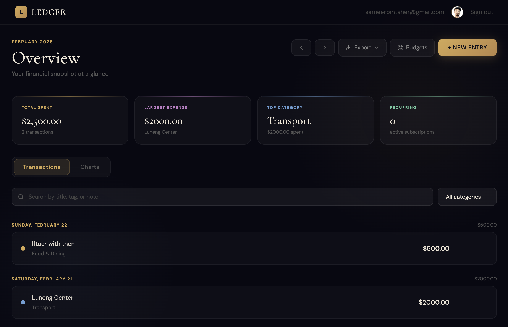
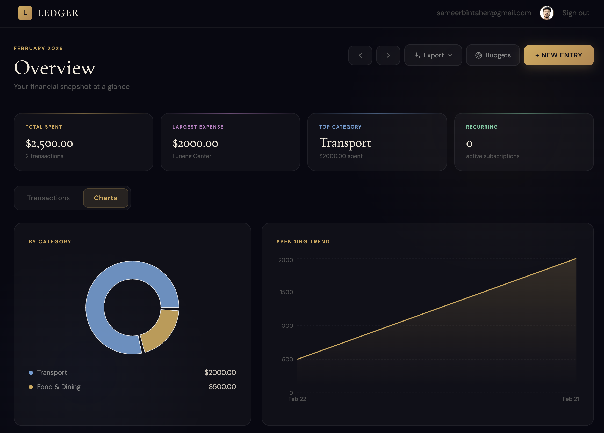

# Ledger — Personal Expense Tracker

A premium full-stack expense tracking application built with Next.js 14, MongoDB, and NextAuth.js. Features a dark luxury design with gold accents.

---

## Features

- **Authentication** — Email/password registration + Google OAuth
- **Expense Management** — Add, edit, delete expenses with categories, tags, notes
- **Recurring Expenses** — Mark expenses as daily, weekly, or monthly
- **Budget Limits** — Set per-category spending limits with progress tracking
- **Search & Filter** — Filter expenses by keyword or category
- **Charts & Analytics** — Pie chart by category, spending trend area chart, budget vs spent bar chart
- **Export** — Download expenses as CSV or PDF
- **Premium UI** — Dark luxury theme with Cormorant Garamond typography and gold accents

---

## Tech Stack

| Layer     | Technology              |
| --------- | ----------------------- |
| Framework | Next.js 14 (App Router) |
| Auth      | NextAuth.js v4          |
| Database  | MongoDB + Mongoose      |
| Styling   | Tailwind CSS            |
| Charts    | Recharts                |
| Email     | Resend                  |
| Icons     | Lucide React            |
| Export    | jsPDF + PapaParser      |

---

## Local Development

### 1. Clone the repository

```bash
git clone https://github.com/YOUR_USERNAME/expense-tracker.git
cd expense-tracker
```

### 2. Install dependencies

```bash
npm install
```

### 3. Set up environment variables

Create a `.env.local` file in the root of the project:

```env
MONGODB_URI=mongodb+srv://<user>:<password>@cluster.mongodb.net/expense-tracker?retryWrites=true&w=majority
NEXTAUTH_URL=http://localhost:3000
NEXTAUTH_SECRET=your-secret-here
GOOGLE_CLIENT_ID=your-google-client-id
GOOGLE_CLIENT_SECRET=your-google-client-secret
RESEND_API_KEY=your-resend-api-key
```

### 4. Run the development server

```bash
npm run dev
```

Open [http://localhost:3000](http://localhost:3000)

---

## Environment Variables

| Variable               | Description                   | Where to get it                                          |
| ---------------------- | ----------------------------- | -------------------------------------------------------- |
| `MONGODB_URI`          | MongoDB connection string     | [MongoDB Atlas](https://cloud.mongodb.com)               |
| `NEXTAUTH_SECRET`      | Random secret for JWT signing | Run `openssl rand -base64 32`                            |
| `NEXTAUTH_URL`         | Your app's base URL           | `http://localhost:3000` locally                          |
| `GOOGLE_CLIENT_ID`     | Google OAuth client ID        | [Google Cloud Console](https://console.cloud.google.com) |
| `GOOGLE_CLIENT_SECRET` | Google OAuth client secret    | [Google Cloud Console](https://console.cloud.google.com) |
| `RESEND_API_KEY`       | Email sending API key         | [Resend](https://resend.com)                             |

---

## Deploying to Vercel

### 1. Push to GitHub

```bash
git init
git add .
git commit -m "Initial commit"
git remote add origin https://github.com/YOUR_USERNAME/expense-tracker.git
git push -u origin main
```

### 2. Import to Vercel

1. Go to [vercel.com](https://vercel.com) and sign in with GitHub
2. Click **Add New Project** and import your repository
3. Vercel will auto-detect Next.js

### 3. Add Environment Variables

In Vercel → Project → Settings → Environment Variables, add all variables from the table above. Set `NEXTAUTH_URL` to your Vercel deployment URL (e.g. `https://your-app.vercel.app`).

### 4. Update Google OAuth

In [Google Cloud Console](https://console.cloud.google.com) → APIs & Services → Credentials → your OAuth client, add your Vercel URL to **Authorized redirect URIs**:

```
https://your-app.vercel.app/api/auth/callback/google
```

### 5. Deploy

Click **Deploy**. Vercel will build and deploy automatically. Every future `git push` triggers a new deployment.

### 6. Results Screenshots

<p align="center">
  
</p>

<p align="center">
  
</p>

## Project Structure

```
expense-tracker/
├── app/
│   ├── api/
│   │   ├── auth/[...nextauth]/   # NextAuth handler
│   │   ├── budgets/              # Budget CRUD
│   │   ├── expenses/             # Expense CRUD
│   │   ├── register/             # User registration
│   │   └── verify-email/         # Email verification
│   ├── dashboard/                # Protected dashboard
│   ├── login/                    # Login page
│   ├── register/                 # Register page
│   └── verify-email/             # Email verification page
├── components/
│   ├── BudgetModal.tsx           # Budget limits UI
│   ├── Charts.tsx                # Recharts visualizations
│   ├── ExpenseList.tsx           # Grouped transaction list
│   ├── ExpenseModal.tsx          # Add/edit expense form
│   ├── ExportMenu.tsx            # CSV/PDF export
│   ├── Navbar.tsx                # Top navigation
│   ├── SearchBar.tsx             # Search and filter
│   └── StatsBar.tsx              # Summary stats cards
├── lib/
│   ├── auth.ts                   # NextAuth configuration
│   ├── constants.ts              # Categories, colors, options
│   ├── db.ts                     # MongoDB connection
│   ├── email.ts                  # Resend email helper
│   └── models/
│       ├── Budget.ts             # Budget mongoose model
│       ├── Expense.ts            # Expense mongoose model
│       └── User.ts               # User mongoose model
└── types/
    └── next-auth.d.ts            # Session type extensions
```

---
